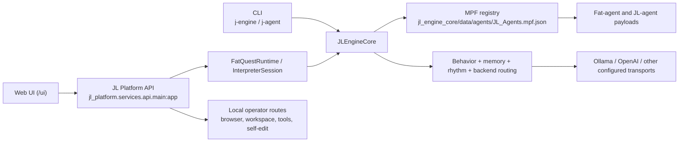

# JL Engine Local Architecture

## Overview

This repository is a layered local runtime:

- `jl_engine_core` owns MPF registry loading, persona selection, behavior state, memory, and backend orchestration
- `jl_platform` adds the richer local app runtime: quest sessions, interpreter flow, browser bridge, workspace actions, and the main FastAPI service
- `ui_web` is the main thin client served by the platform API

The architecture is a layered monolith rather than a microservice split. Most behavior lives in-process and shares the same runtime data tree.

## System map

## Execution flow

### Engine-mediated user flow

1. A UI or client sends chat, run, mission, or switch requests to `/quest/*`.
2. `FatQuestRuntime` ensures the requested agent session exists.
3. `JLEngineCore` loads the agent from the MPF registry into the live session.
4. `InterpreterSession` handles approvals, tool use, and follow-up actions around the engine reply.
5. The response returns to the UI with any pending confirmation state.

### Local operator flow

Some routes are intentionally direct local controls rather than conversational engine turns. These include browser bridge management, workspace save/review helpers, tool-forge endpoints, and self-edit process controls.

Those routes exist to operate the local workstation and should be treated as admin surfaces, not as internet-facing product endpoints.

## Fat-agent model

The MPF registry is a pointer layer, not the full persona.

- Registry entries such as `SparkByte` point to payload files like `fat_agents/SparkByte_Full.json`
- `JLEngineCore.set_agent(...)` resolves the registry entry, loads the payload, and stores it as the active session profile
- modular fat agents such as `SparkByte Modular` resolve through `jl_engine_core/modular_agents.py` before becoming the active payload

That means fat agents are not bypassing the engine. They are the persona capsules the engine actively loads and runs.

## Main entrypoints

- Full platform API: `src/jl_platform/services/api/main.py`
- Compatibility API: `jl_engine_core/api_app.py`
- CLI: `src/jl_engine_cli/main.py`
- Desktop UI: `ui/pyside_ui.py`
- Web UI: `ui_web/`

## Current pressure points

These are the main maintainability weak spots without changing behavior:

- very large files in `engine_core.py`, `quest_runtime.py`, `interpreter.py`, and `ui/pyside_ui.py`
- mixed admin and user-facing routes in the same API module
- multiple mirrored data trees at repo root versus the runtime data tree under `jl_engine_core/data/`
- inconsistent error response shapes across some API surfaces

## Safe direction for future refactors

- keep user-facing task execution on engine-mediated quest/interpreter flows
- keep local operator routes available, but document and fence them as local/admin only
- extract large modules by concern rather than rewriting behavior
- keep `jl_engine_core/data/...` as the canonical runtime tree and avoid editing mirrored root copies unless the runtime truly reads them
