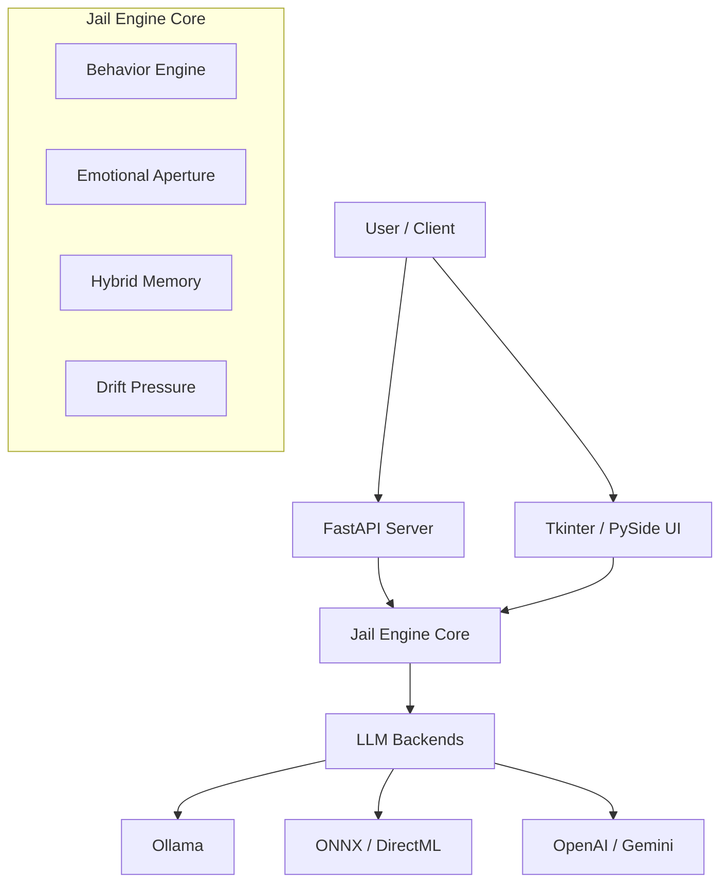

# Jail Engine: No Pickles, Extra Cheese

> **Empowering AI with Emotional Intelligence, Behavioral Consistency, and SaaS-Ready Scalability.**

Jail Engine is a state-of-the-art orchestration layer designed to transform static LLM interactions into dynamic, persona-driven experiences. Unlike simple wrappers, Jail Engine simulates a "living" cognitive architecture complete with emotional states, behavioral rhythms, and long-term memory integration.

It serves as both a **SaaS-ready API platform** for developers building persona-based applications and a **robust local engine** for power users and researchers.

---

## 📚 Table of Contents

- [Core Philosophy](#core-philosophy)
- [Key Features](#key-features)
  - [The Cognitive Engine](#the-cognitive-engine)
  - [MPF Open Standard](#mpf-open-standard)
  - [SaaS & Monetization](#saas--monetization)
  - [Temporal Quantum Agents (TQA)](#temporal-quantum-agents-tqa)
- [Architecture](#architecture)
- [Installation](#installation)
  - [Local Python Setup](#local-python-setup)
  - [Docker Deployment](#docker-deployment)
  - [Windows Portable Build](#windows-portable-build)
- [Quick Start](#quick-start)
  - [Running the API](#running-the-api)
  - [Running the GUI](#running-the-gui)
- [Configuration](#configuration)
  - [Environment Variables](#environment-variables)
  - [Managing Personas (MPF)](#managing-personas-mpf)
  - [Model Backends](#model-backends)
- [API Reference](#api-reference)
- [Developer Guide](#developer-guide)

---

## Core Philosophy

Most AI agents are stateless and "flat"—they respond to prompts but lack an internal world. **Jail Engine** introduces a **Headless Core** architecture that maintains:

1.  **Emotional Context:** Not just *what* was said, but *how* the agent feels about it (Aperture).
2.  **Behavioral Drift:** How interaction pressure pushes the agent's personality over time.
3.  **Cognitive Modes:** distinct reasoning strategies (e.g., Analytical, Creative, Empathetic) that shift dynamically.
4.  **Rhythm:** The cadence of interaction, ensuring the agent doesn't just "dump text" but communicates naturally.

---

## Key Features

### The Cognitive Engine
At the heart of the system is `JailEngineCore` (`engine_core.py`), a framework-agnostic orchestrator that manages:
*   **Behavior Grid:** A coordinate system tracking the agent's current state (e.g., "Helpful/Calm" vs. "Defensive/Erratic").
*   **Emotional Aperture:** Controls the "width" of the agent's emotional expression (Focus vs. Expressiveness).
*   **Cognitive Modes:** Dynamic switching between thinking styles (e.g., `Deep Thought` vs. `Quick Reply`).
*   **Drift Pressure:** A system that models psychological stress, allowing the agent to "snap" or "evolve" during long conversations.

### MPF Open Standard
The engine utilizes the **Modular Persona Format (MPF)**, a strict JSON schema for defining portable, secure AI personas.
*   **Manifests:** Personas are defined in `.mpf.json` files containing metadata, behavioral prompts, and assets.
*   **Integrity:** Built-in SHA256 hashing ensures persona files haven't been tampered with.
*   **Assets:** Personas can bundle their own voice configuration, knowledge base, and style guides.

### SaaS & Monetization
Built for business from day one:
*   **API Key Management:** Built-in Auth middleware with rate limiting.
*   **Billing Integration:** SQLite-backed usage tracking with Stripe checkout support.
*   **Tiered Plans:** Support for Free, Indie, and Pro tiers with configurable request limits.
*   **Pre-loaded Business Personas:** Includes "SaaS Copywriter", "Cold Outreach Assistant", and "Startup Pitch Writer".

### Temporal Quantum Agents (TQA)
A sophisticated sub-system for handling complex, multi-step reasoning:
*   **Phase Gating:** Ensures optimization happens in strict stages to prevent logic drift.
*   **Advisory Hints:** TQA provides high-level strategic guidance to the LLM without overriding the core persona.

---

## Architecture

The project follows a "Headless Core" design pattern:



*   **`engine_core.py`**: The brain. Accepts input -> Processes State -> Generates System Prompt -> Calls Backend -> Returns Response + Telemetry.
*   **`api_server.py`**: The REST interface exposing the Core to the web.
*   **`main_app.py`**: A reference GUI implementation.

---

## Installation

### Prerequisites
*   **Python 3.10+**
*   **Git**
*   *(Windows Only)* **Visual C++ Build Tools** (required for `PyAudio` and some ML dependencies).

### Local Python Setup
1.  **Clone the repository:**
    ```bash
    git clone https://github.com/your-org/JL_Engine.git
    cd JL_Engine
    ```
2.  **Create a virtual environment:**
    ```bash
    python -m venv .venv
    source .venv/bin/activate  # Linux/Mac
    .venv\Scripts\activate     # Windows
    ```
3.  **Install dependencies:**
    ```bash
    pip install -r requirements.txt
    ```
4.  **Configure Environment:**
    ```bash
    cp .env.example .env
    # Edit .env with your API keys (OPENAI_API_KEY, GEMINI_API_KEY, etc.)
    ```

### Docker Deployment
Perfect for server/cloud deployment.
```bash
docker compose up --build
```
The API will be available at `http://localhost:8080`.

### Windows Portable Build
Create a standalone `.exe` that requires no Python installation on the target machine.
```bat
JL_Engine\build_windows_exe.bat
```
Artifacts will be placed in `dist/JL_Engine/`.

---

## Quick Start

### Running the API
Start the server to handle HTTP requests:
```bash
uvicorn api_server:app --host 0.0.0.0 --port 8080
```

**Test with cURL:**
```bash
curl -X POST http://localhost:8080/chat \
  -H "x-api-key: your_generated_key" \
  -H "Content-Type: application/json" \
  -d '{"message": "Hello, who are you?", "persona_name": "SaaS Copywriter"}'
```

### Running the GUI
Launch the visual interface to see the "Behavior Grid" and "Telemetry" in real-time.
```bash
python main_app.py
```

---

## Configuration

### Environment Variables
Key variables in `.env`:
*   `DEFAULT_BACKEND`: `ollama`, `openai`, `google`, or `onnx`.
*   `OLLAMA_BASE_URL`: URL for your local Ollama instance (default `http://localhost:11434`).
*   `STRIPE_SECRET`: For enabling real payments (optional).
*   `API_DB_PATH`: Path to the SQLite billing database.

### Managing Personas (MPF)
To create a new persona:
1.  Copy `docs/MPF_MANIFEST_TEMPLATE.mpf.json`.
2.  Fill in the `persona` object (name, style, system prompts).
3.  Run the linter to sign it:
    ```bash
    python tools/mpf_lint.py personas/my_new_persona.mpf.json --rewrite-hash
    ```

### Model Backends
*   **Ollama:** Zero-config local inference. Ensure Ollama is running.
*   **ONNX / DirectML:** Optimized for Windows NPU/GPU acceleration. Requires `onnxruntime-genai-directml`.
*   **Cloud APIs:** Set `OPENAI_API_KEY`, `GEMINI_API_KEY`, or `ANTHROPIC_API_KEY` in `.env`.

---

## API Reference

| Endpoint | Method | Description |
| :--- | :--- | :--- |
| `/chat` | POST | Main chat interface. Accepts message history and persona. Returns reply + telemetry. |
| `/persona-chat` | POST | Like `/chat` but enforces a specific persona context. |
| `/analyze` | POST | specialized endpoint that wraps input in an analytical system prompt. |
| `/billing/checkout` | POST | Initiates a Stripe checkout session for API credits. |
| `/pricing` | GET | Returns available subscription plans. |

---

## Developer Guide

### Directory Structure
*   `core/`: Internal logic libraries.
*   `framework/`: Configuration schemas and master JSONs.
*   `memory/`: Storage for sessions and learned facts.
*   `MPF_Open_Standard/`: The reference implementation for the persona format.
*   `personas/`: The library of available characters/agents.
*   `tools/`: Utilities for linting, migration, and testing.

### Contributing
1.  **MPF Standard:** Changes to the persona format must be validated against `tools/mpf_lint.py`.
2.  **Backends:** Add new LLM providers in `backends.py` by extending the `BaseBackend` class.
3.  **Testing:** Run the smoke test suite before committing:
    ```bash
    python engine_smoke_test.py
    ```

---

*(c) 2024-2025 Jail Engine Project. All Rights Reserved.*