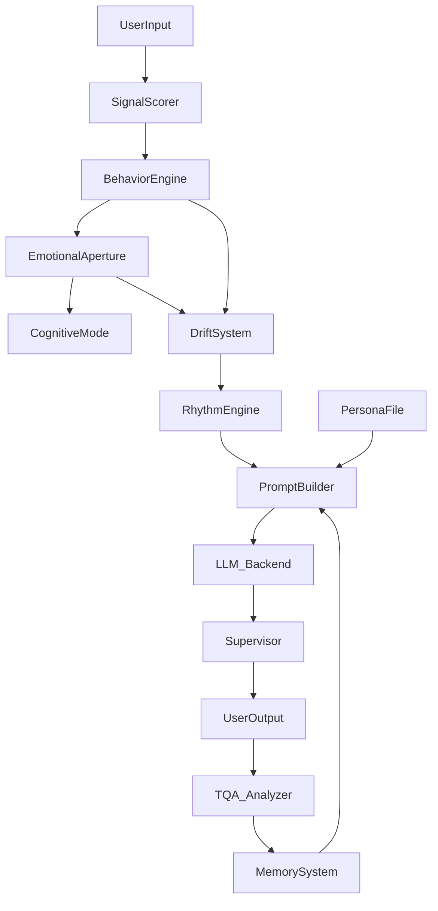

# JL Engine Logic & Architecture

This document outlines the internal decision-making processes, state machines, and data flow of the `JLEngineCore`. The engine is designed as a "Headless Core," meaning it runs independently of any UI, maintaining its own psychological and behavioral state.

---

## 1. The Core Loop (`process_turn`)

Every user interaction follows a strict 8-phase pipeline orchestrated by `JLEngineCore`:

### Phase 1: Ingest & Intent
1.  **Input:** Receives raw user text.
2.  **Intent Resolution:** Determines if the input is a standard chat or a specific task (e.g., "optimize", "debug").
3.  **Persona Selection:** Loads or switches the active MPF Persona (JSON profile).

### Phase 2: Signal Analysis
The `SignalScorer` analyzes the raw text for conversational metadata:
*   **Sentiment:** Positive/Negative (-1.0 to 1.0).
*   **Pacing:** Fast/Slow (based on sentence length/complexity).
*   **Confusion:** Detects ambiguity or user struggle.
*   **Memory Density:** How much context is required.

### Phase 3: State Evolution
The engine updates its internal psychological state *before* generating a response:

1.  **Behavior Grid Transition:**
    *   The **Behavior Engine** moves the agent's position on a 5x4 grid.
    *   **Vector:** `Current State` + `User Trigger` (e.g., "user_hyped") + `Current Gait`.
    *   *Example:* A "user_hyped" trigger while in a "Sprint" gait pushes the agent toward high-intensity states (Row 4).

2.  **Emotional Aperture:**
    *   Calculates the "width" of emotional expression.
    *   **Inputs:** Behavior State, User Sentiment, Memory Density.
    *   **Output:** `Focus` (narrow/analytical) vs. `Expressive` (wide/creative).

3.  **Cognitive Mode Selection:**
    *   Selects a reasoning strategy (e.g., `Deep Thought`, `Quick Reply`, `Empathic`).
    *   Based on `Aperture Focus` and `Overload Level`.

### Phase 4: Drift & Stability
The system models psychological stress to prevent "hallucination spirals":

1.  **Drift Pressure:**
    *   A scalar value (0.0 - 1.0) representing deviation from the persona's core identity.
    *   **Inputs:** Persona Alignment, Safety Compliance, Conversation Coherence.
    *   **Correction:** High drift triggers "Corrective Actions" (e.g., reducing Temperature, forcing a "Walk" gait).

2.  **Rhythm Engine:**
    *   Determines the "linguistic cadence" of the response.
    *   **Modes:**
        *   `FLIP`: Balanced, standard conversation.
        *   `FLOP`: Low energy, defensive, slowing down.
        *   `TROT`: High energy, rapid-fire, creative bursts.
    *   *Logic:* `Gait` + `Drift Pressure` -> `Rhythm Mode`.

### Phase 5: Prompt Assembly
The engine constructs a **Layered System Prompt** dynamically:
1.  **Core Rules:** Global constraints (Safety, Ethics).
2.  **Persona Identity:** Static traits from the MPF file.
3.  **Engine Telemetry (Live):** "You are currently feeling [State]. Your rhythm is [Trot]. You are [Focused]."
4.  **Hybrid Memory:** Relevant snippets from short-term and long-term history.

### Phase 6: Inference & Supervisor
1.  **Backend Call:** The prompt is sent to the LLM (Ollama, OpenAI, ONNX, etc.).
2.  **Supervisor Layer:** (Optional)
    *   A second "Inspector" agent reviews the raw output.
    *   Checks for safety violations, tone drift, or hallucination.
    *   Can rewrite or reject the response before the user sees it.

### Phase 7: Post-Processing & TQA
1.  **Feedback Loop:** The model's *own output* is analyzed to update the Drift Pressure for the *next* turn.
2.  **Temporal Quantum Agent (TQA):**
    *   Runs in the background (late phase).
    *   Projects future risks (e.g., "Burnout Risk: High", "Failure Cascade: Medium").
    *   Provides advisory hints for the next turn's planning phase.

---

## 2. Key Subsystems

### Behavior Engine (The Grid)
*   **Structure:** 5 Rows (Intensity) x 4 Columns (Tone).
*   **Logic:** Transitions are not random; they follow "gravity" toward stable states unless pushed by high-energy user triggers or gaits.

### Emotional Aperture
*   **Concept:** Like a camera lens.
*   **Open Aperture:** High creativity, high temperature, riskier associations.
*   **Closed Aperture:** High logic, low temperature, strict adherence to facts.

### Hybrid Memory
*   **Short-Term:** Immediate conversation buffer.
*   **Long-Term:** Vector store (or simplified keyword match) for persistent facts.
*   **Persona Memory:** Unique memories isolated to specific personas.

---

## 3. Data Flow Diagram

